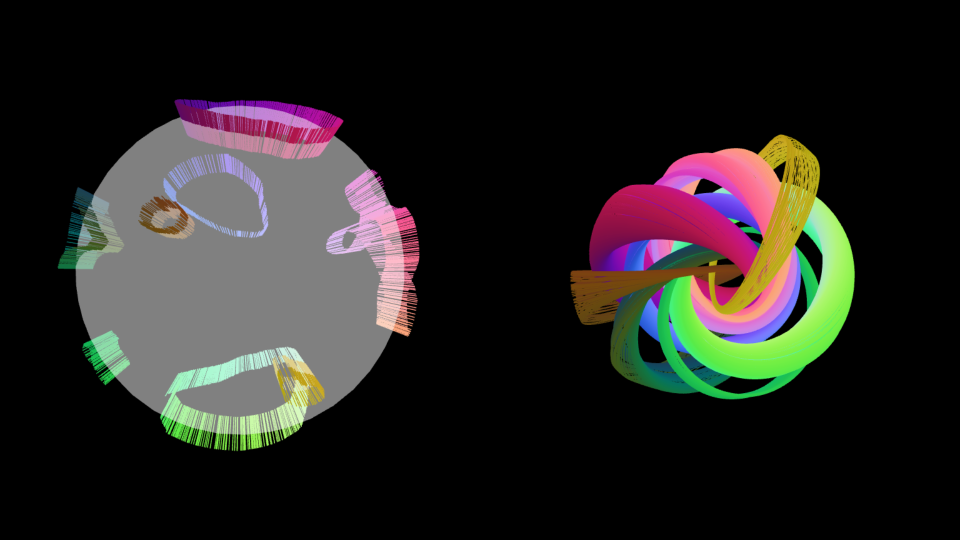

# hopf_fibration

The Hopf fibration

**S**1 ↪  **S**3 ↠ **S**2

is a canonical nontrivial circle bundle over the 2-sphere **S**2 whose total space is the 3-sphere **S**3.

It is one of the few beautiful objects in topology that can be easily visualised.

The left-hand frame shows the 2-sphere **S**2 with marked points depicted by coloured pins.

The right-hand frame shows a stereographic projection of the fibres corresponding to these marked points onto the unit ball **D**3 ⊂ **R**3.

Any two of these circular fibres are interlinked.

See [nilesjohnson.net](https://nilesjohnson.net/hopf-production.html) for precise details of the projection, or [wikipedia](https://en.wikipedia.org/wiki/Hopf_fibration) for general information. 

## Controls
  - left-click on right-side: rotates;
  - right-click on left-side: draws fibres;
  - left-click on left-side: rotates and draws fibres;
  - touch controls: use landscape mode.

## [Go to demonstration](https://nasosev.github.io/files/demos/hopf_fibration)
  ---
  Written by Nasos Evangelou-Oost, June 2019.